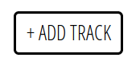
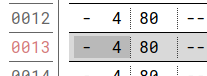
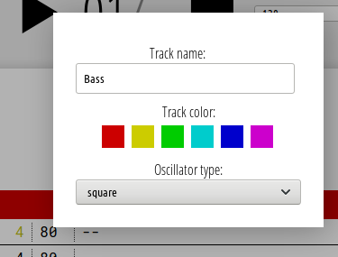
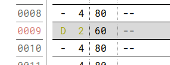
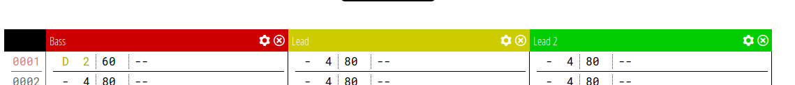

# Bonjour Tracker

This is a fun side project to demonstrate some of the WebAudioAPI capabilities. It's not very complete, and I haven't spend that much time on it.

## [Live Demo](http://bonjourinternet.top/misc/bjrtracker/)

## How does it work

* Add a track 
* Click on the column on the left to add a note. You can remove it by right clicking it 
* Click on the cog on top of the track to change its settings (name, color and oscillator type) 
* You can increase (left click) or decrease (right click) the volume of a note using the second column, values go from 0 (silent) to 100 (loudest) 
* You can have several tracks with independent oscillator to create harmonies 

## Build from source

Compiles and hot-reloads for development
```
yarn serve
```

Compiles and minifies for production
```
yarn  build
```

## To do
* Save presets to localstorage
* Add FX
* Add envelopes
* Better UX/UI